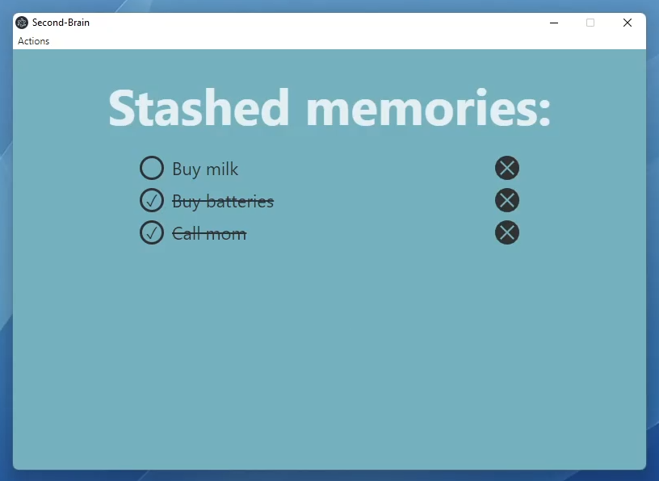

# Second Brain
An Electron based productivity application made for easily clearing your mind, while not letting go of your current task.

Store thoughts, ideas and sidetracks as they come up, without interrupting what you're currently engaged in. Your second brain is just one keyboard shortcut away.

- **Ctrl/Cmd+alt+I** : Insert new thought

- **Ctrl/Cmd+alt+B** : Open the list of stored-away thoughts

